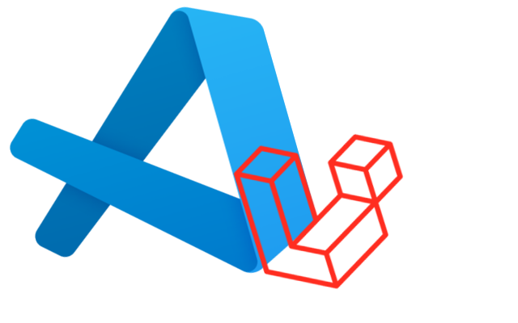
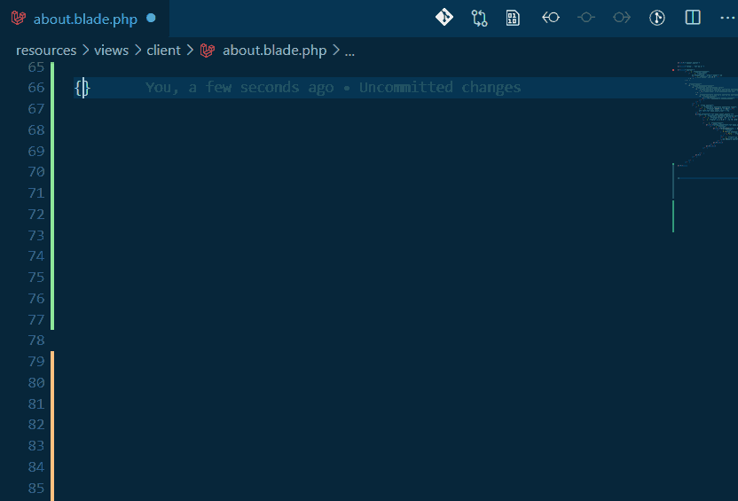
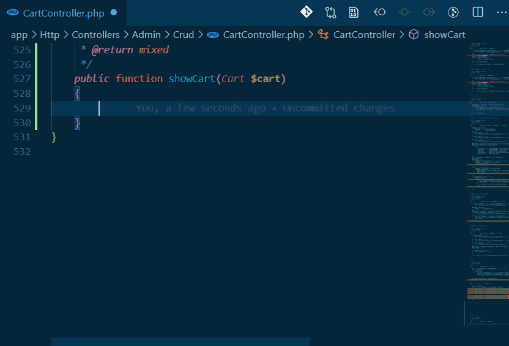
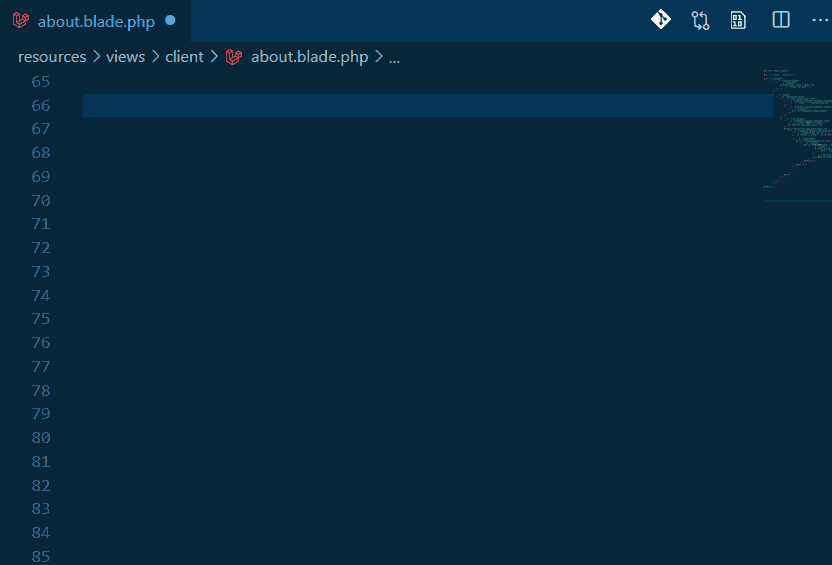
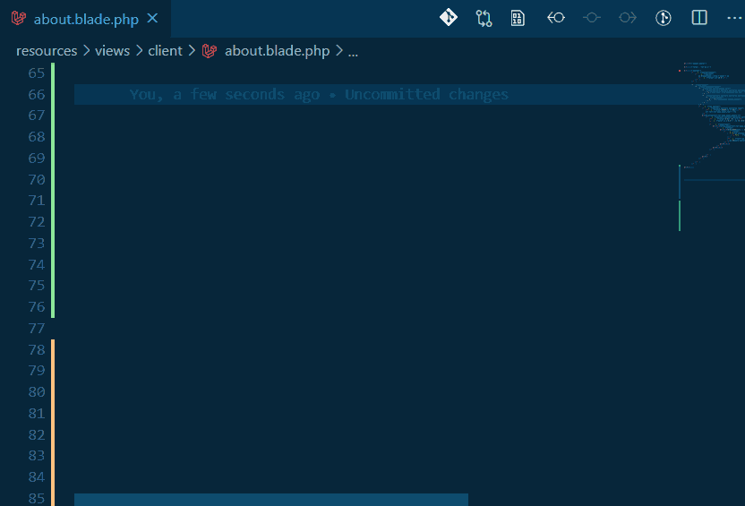
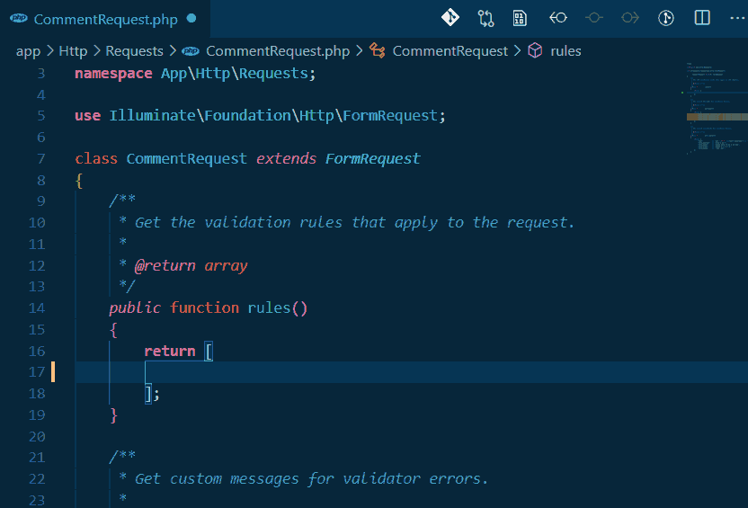
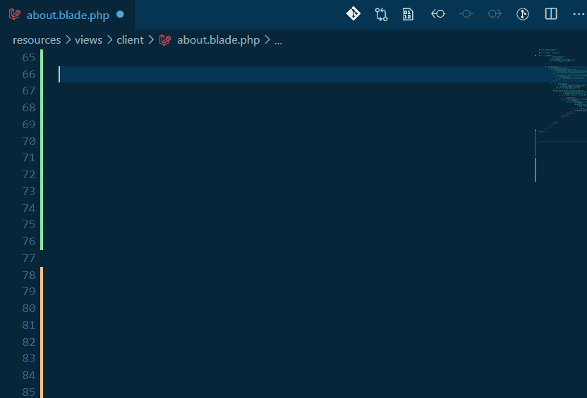
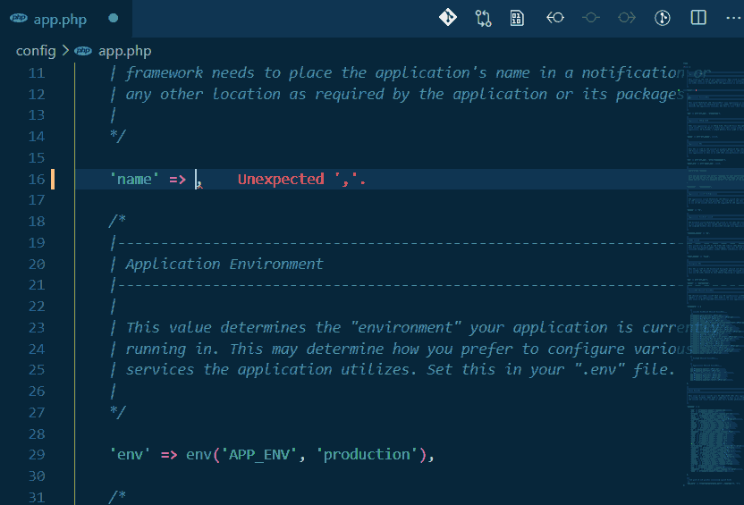
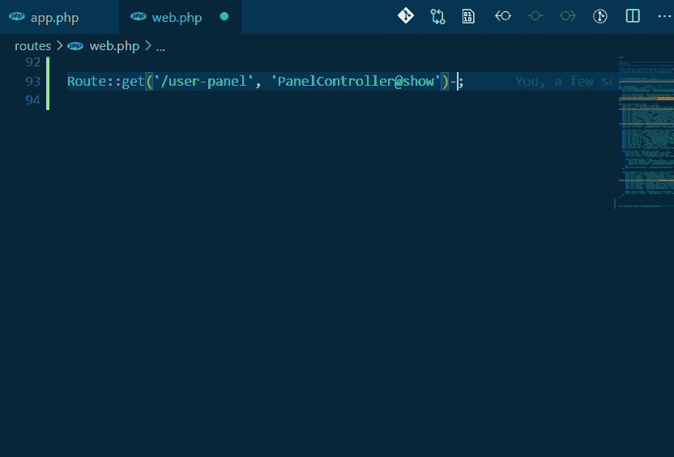

<h1 align="center">Laravel Extra Intellisense</h1>

<div align="center">
    
</div>

This extension provides [Laravel](https://laravel.com/) routes, views and ... autocomplete for [VSCode](https://code.visualstudio.com/).

## Autocomplete
* [Route names and route parameters](#route-names-and-route-parameters)
* [Views and variables](#views-and-variables)
* [Configs](#configs)
* [Translations and translation parameters](#translations-and-translation-parameters)
* [Laravel mix function](#laravel-mix-function)
* [Validation rules](#validation-rules)
* [View sections and stacks](#view-sections-and-stacks)
* [Env](#env)
* [Route Middlewares](#route-middlewares)
* Asset
* Model Attributes (Beta!)

### Route names and route parameters

### Views and variables

### Configs

### Translations and translation parameters

### Laravel mix function

### Validation rules

### View sections and stacks

### Env

### Route Middlewares


## Configuration
### LaravelExtraIntellisense.customValidationRules:
Your custom validation rules snippets.

Example:
```json
"LaravelExtraIntellisense.customValidationRules": {
    "mobile": "mobile",
    "distance_gt": "distance_gt:${0:1km}"
}
```

### LaravelExtraIntellisense.phpCommand
Command to run PHP codes to interact with your Laravel application.

Default:
`php -r \"{code}\"`
> Note: {code} is PHP code generated by extension and should be wrapped with "".

### LaravelExtraIntellisense.basePath
Base path of your Laravel application. useful if your Laravel project is not at the root of you project directory.

### LaravelExtraIntellisense.basePathForCode
Same as `LaravelExtraIntellisense.basePath` but this one using for `require_once` in generated PHP codes.

### LaravelExtraIntellisense.viewDirectorySeparator
You also can use `/` instead of `.` as directory separator for view autocomplete.

### LaravelExtraIntellisense.modelsPaths
Array of paths including your models. (Default: `["app", "app/Models"]`)

#### Sample config to use docker
This is a simple configuration to use via [Laradock](https://github.com/laradock/laradock).
It is possible to use this extension with other docker images or even other virtual machines.

```json
"LaravelExtraIntellisense.phpCommand": "docker exec -w /var/www/your-project -u laradock laradock_workspace_1 php -r \"{code}\"",
"LaravelExtraIntellisense.basePathForCode": "/var/www/your-project"
```

## Release Notes

### 0.5.0
* Add `asset` support.

### 0.4.0
* Add Docker support.

### 0.3.3
* Performance improvement.
* Bug fixes (#25, #26)

### 0.3.2
* Add configuration for views separator (#22).
* `can`, `cannot` autocomplete.

### 0.3.1
* Fix #18.

### 0.3.0
* `env` autocomplete added.
* Route `middleware` autocomplete added.
* Nested stack and section support added.
* Function parser improvement.

### 0.2.6
* Blade stack autocomplete added.
* Duplicate section autocomplete items fixed.
* PHP commands converted to async functions to prevent unresponsive extension host error.

### 0.2.4
* Blade section autocomplete added.

### 0.2.3
* View parameters autocomplete.
* Route autocomplete bug in linux fixed.

### 0.2.2
* Auto-Retry removed from all providers. causes some performance issues.
* Disable logging added.

### 0.2.1
* `markdown` function added to view functions for autocomplete.
* Using file watcher instead of save event. Better change detect for view autocomplete.
* json translation autocomplete added.

### 0.2.0
Validation rules autocomplete added.
works with `Validator` class, `validate` functions and inside request classes.

### 0.1.5
Route action autocomplete added. `Route::get`, `Route::post`,... autocompletes controller actions inside app\Http\Controllers.

### 0.1.2 - 0.1.4
Performance improvments.

### 0.1.1
Add mix autocomplete.

### 0.1.0
Fix problems with linux.
Add translation autocomplete.
Improved providers.

### 0.0.6
Config autocomplete added.

### 0.0.5
Route bug fix.

### 0.0.4
View names with namespaces ready to use.

### 0.0.3
View functions autocompelete added.

### 0.0.2
Blade bug fix.

### 0.0.1
Add route autocomplete.


## Recommended extensions
* [PHP Intelephense](https://marketplace.visualstudio.com/items?itemName=bmewburn.vscode-intelephense-client)
* [PHPCS](https://marketplace.visualstudio.com/items?itemName=ikappas.phpcs)
* [PHP DocBlocker](https://marketplace.visualstudio.com/items?itemName=neilbrayfield.php-docblocker)
* [PHP formatter](https://marketplace.visualstudio.com/items?itemName=kokororin.vscode-phpfmt)
* [Laravel Blade Snippets](https://marketplace.visualstudio.com/items?itemName=onecentlin.laravel-blade)
* [Laravel goto view](https://marketplace.visualstudio.com/items?itemName=codingyu.laravel-goto-view)
* [Laravel goto controller](https://marketplace.visualstudio.com/items?itemName=stef-k.laravel-goto-controller)

## Credits
* [PHP parser](https://github.com/glayzzle/php-parser)
